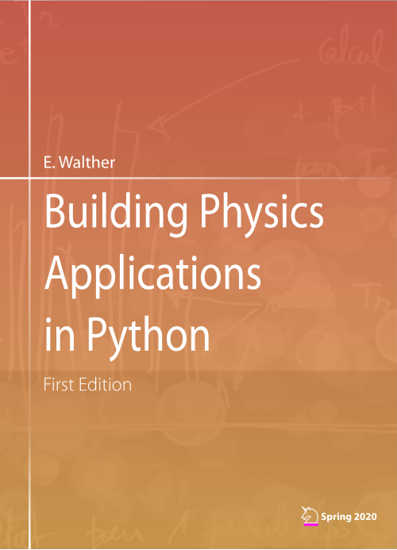

Written during Spring 2020 as an attempt to make something out the global lock-down, these pages present
an overview of building physics applications in python language for students, teachers or engineers.

## Get the book

- [Download a .pdf copy of the book](link_to_the_book)
- [Access the Github repository](https://github.com/eddes/buildingphysics)

## What this book is about

At one end of the scientific literature, profusion of books about solving partial differential equations exist, however often with a somewhat unfamiliar mathematical formalism. At the other end, books about
building physics may be either technical about HVAC or generic about the numerical models used.

Having struggled quite a bit in the past years with the practical implementation of numerical methods
in this field, it appeared that putting together the recipes used in a modern programming language could
be of some interest for others.

The *parti pris* in this book is hence to **show the link between the governing equations and how to solve
them**, aiming at a practical use, namely `how to make things work`. It is meant to be a toolbox for simulation engineering, a basis for the illustration of theory, or a kick-start for the study of more complex
problems.

This manual is composed of three chapters, with a gradual increase in the difficulty:

- **Chapter 1** succinctly explains the **fundamentals of the numerical methods used.

- **Chapter 2** shows applications to heat transfer in phase change materials, PID control and indoor air
quality.

- **Chapter 3** is about coupled problems and minimisation. Applications to polydispersed aerosols in
enclosures, heat and mass transfer in walls and parameter fitting for transient problems are proposed.

## What about this book

For all cases examined in the following chapters, source code or supplementary material such as pollution/weather data are available. Two types of users may be interested:

- If you want to play with the parameters of the models described, a simple a web browser is sufficient,
as interactive plots are at your disposal for many of the examples via the use of **jupyter notebooks**.

- If you intend to make your own tests or applications, the code can be downloaded from this Github
repository.

In each section, a specific link pointing to the corresponding address of the procedure in the repository is
provided. Have fun!

As a few animations are presented throughout the sections, you may find it enjoyable to read these
pages with a compatible PDF viewer (such as Adobe Reader or Foxit).

## Licence

This work is licensed under a Creative Commons “AttributionNonCommercial-ShareAlike 3.0 Unported” license. 

